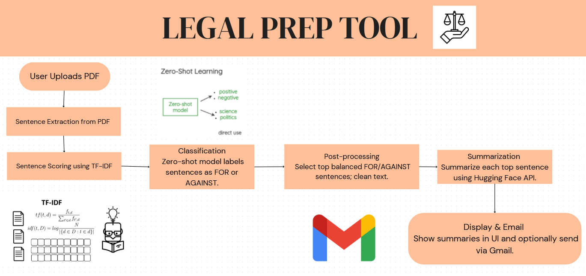

# ⚖️ LegalPrepTool  

**LegalPrepTool** is an AI-powered assistant that helps lawyers and legal professionals **analyze court documents** and **prepare case arguments** efficiently.  

Upload a PDF brief, extract key sentences, classify them as **For** or **Against**, generate concise summaries, and even share them via email—all in one streamlined workflow.  

---

## 🖼️ Workflow  

> _This diagram shows how LegalPrepTool works behind the scenes._  

  

---

## 📸 Screenshots  

Here’s a walkthrough of the tool in action:  


  


  


  

 
  

---

## 🧠 Features  

- 📄 Upload and process legal PDF documents  
- ✂️ Extract and score key candidate sentences with TF-IDF  
- ⚖️ Classify arguments as **For** or **Against** using Hugging Face models  
- 📝 Summarize top balanced arguments into concise briefs  
- 📧 Share results directly via Gmail  
- 💻 Clean Streamlit UI for interactive use  

---

## 🎯 Ideal Use Cases  

- Prepare for court cases with quick, AI-assisted briefs  
- Summarize large legal documents into key arguments  
- Support attorneys with balanced **For vs Against** analysis  
- Build a foundation for advanced legal research assistants  

---

## 🛠️ Tech Stack  

| Component         | Technology                               |  
|------------------|-------------------------------------------|  
| Frontend          | Streamlit                                |  
| PDF Processing    | Pdfplumber                               |  
| Sentence Scoring  | Scikit-learn (TF-IDF)                    |  
| Classification    | Hugging Face Transformers                |  
| Summarization     | Hugging Face Transformers                |  
| Email Integration | Python smtplib + Gmail API               |   

---

## 📦 Installation  

1. **Clone the repository**  

```bash
git clone https://github.com/yourusername/LegalPrepTool.git
cd LegalPrepTool
